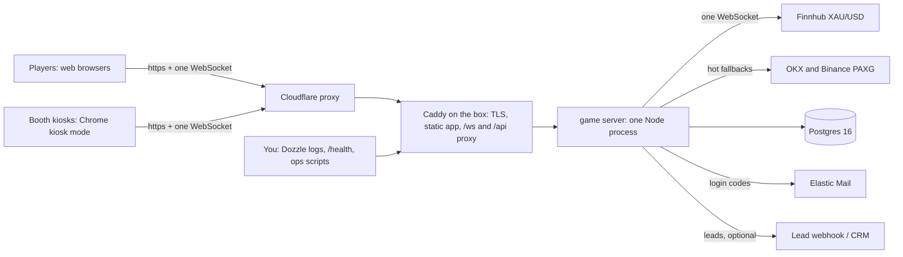

# The box - architecture and production requirements

This is the topology we are shipping. The earlier five-provider design (Supabase, Vercel, Fly, Finnhub, Elastic) is archived under `docs/legacy-supabase/` for reference; nothing in it is deployed.

## 1. The parts and how they work together

One machine, three containers, one external dependency that matters (the price feed) and one that is optional (email).

| Part | Responsibility | Never does |
|---|---|---|
| **Cloudflare** (free plan, proxy on) | Public DNS for the campaign domain, TLS to the visitor, hides the box's IP, absorbs junk traffic, edge rate limiting | Hold any game state |
| **Caddy** (container) | Serves the built app from `dist/`, terminates TLS from Cloudflare, proxies `/ws`, `/api/*`, `/health` to the game server | Game logic |
| **Game server** (container, Node) | Holds the one upstream Finnhub socket and fans ticks to every browser as one continuous price series; opens rounds, runs the 5-second timer, settles against its own price and pushes the verdict down the same socket; owns the ledger through Postgres functions; kiosk sessions and coupon claims; login codes; `/api/lead` | Trust anything a browser asserts about outcomes, coins, streaks or coupons |
| **Postgres 16** (container, not published) | All state: players, rounds (full audit trail), kiosks, coupons, tasks, login codes. Row-level rules plus function-only writes | Accept connections from anything but the game server |
| **Finnhub** | Broker XAU/USD ticks over one keyed WebSocket | - |
| **OKX / Binance** | PAXG (gold token) ticks, kept hot as fallbacks; the server offsets them so a source switch never jumps the price | - |
| **Elastic Mail** | Sends the 8-digit login code with the branded template | Generate or verify codes |
| **Dozzle** (container, Layer 1.5 D1) | Live container logs in a browser for the operator | - |

The one rule everything serves: **the server decides every outcome; the browser is a display.**

## 1b. The client - who serves it

**The box serves the client.** `npm run build` produces `dist/` (a static Vite/React bundle); Caddy serves it at the campaign domain, and Cloudflare caches the static files at its edge so most page loads never reach the box. There is no Vercel and no extra subscription; Vercel belonged to the old topology.

- The build is made **once, locally**, with `VITE_GAME_WS=auto` (the socket URL is derived from the page's own origin, so the same build works on any domain). Node is not installed on the box.
- Deploying a UI change is: `npm run build`, copy `dist/` to the box - the Caddy mount is live, so the new files are served immediately with no restart. That is the marketing lead's whole deployment procedure.
- The client talks to exactly one backend endpoint: `wss://<domain>/ws`. It opens no other sockets and polls nothing.

## 2. Domains

| Domain | Points at | Owner action |
|---|---|---|
| Campaign domain, e.g. `goldrush.xchief.com` | Cloudflare (proxied) -> the box's IP | Admin: add an A record in Cloudflare, proxy ON |
| `goldrush.xchief.academy` (email sending) | Elastic Mail | Done: SPF, DKIM, DMARC verified |
| Kiosk devices | `https://<campaign domain>/kiosk` | Same URL on every device; each self-provisions its own identity on first load (ticket K1) - nothing to generate or distribute per device (ticket S3) |

The game server must know its public origin (`SITE_ADDRESS`) for Caddy's TLS and, in Layer 2, for origin pinning.

## 3. What we need from the administrators

| Item | Detail |
|---|---|
| **One Linux VPS** | Ubuntu 24.04 LTS, 4 vCPU, 8 GB RAM, 80 GB SSD, in a European region (Frankfurt/Amsterdam - Finnhub and Cloudflare are fine from there; Dubai visitors go through Cloudflare's edge). Any of Hetzner, DigitalOcean, Vultr, OVH. With provider **snapshots** enabled. Root SSH access to the developer (key, not password). |
| **Cloudflare** | The campaign domain in a Cloudflare zone (free plan). Add the developer as a member, or do the one A record and the Access/WAF settings below yourself. |
| **Elastic Mail** | Already provisioned (template `gold_rush_otp`, verified subdomain). Hand over the API key for production only, through a secure channel; it goes straight into the box's `.env`, never into chat or a repo. |
| **Finnhub** | The existing key works (real-time XAU/USD confirmed over WebSocket). Nothing more. |
| **Coupon codes** | The real list of $100 codes, loaded on the box with `npm run coupons:load -- codes.txt`. |
| **A phone number or email for alerts** | Where the "feed silent" / "server restarted" alert should go (Layer 1.5 D1). |

No GitHub, Vercel, Supabase or Fly accounts are needed any more.

## 4. What is installed on the server

Only Docker. Everything else runs inside containers from the repo's `docker-compose.yml`:

- `docker` engine + `docker compose` plugin (the official one-line install script)
- `git` (to clone/pull the repo) and `ufw` (already present on Ubuntu)
- nothing else: no Node, no Postgres, no Caddy on the host

Containers: `caddy:2`, `postgres:16`, the game server image built from `server/Dockerfile` (node:22-alpine), and Dozzle. Data lives in two Docker volumes (`pgdata`, `caddy_data`) - those two volumes plus `.env` are the entire state of the box.

## 5. Linux hardening for the box (minimum, done before it goes public)

| Measure | Why |
|---|---|
| SSH: key-only, `PermitRootLogin prohibit-password`, `PasswordAuthentication no` | The only door onto the machine |
| `ufw`: allow 22 from your IP (or everywhere if you must), allow 80 and 443 **only from Cloudflare's IP ranges**; deny everything else. Postgres (5432), the game server (8787) and Dozzle are not published at all | Nobody can bypass Cloudflare and hit the box directly; the database is unreachable from the internet |
| Unattended security upgrades on (`unattended-upgrades`), reboot window at 04:00 | Patched kernel without you remembering |
| `fail2ban` for SSH | Stops brute force noise |
| Docker `restart: unless-stopped` on every container; the game server voids open rounds on start | A crash or reboot heals itself |
| `.env` on the box: `chmod 600`, owned by root; never copied anywhere | The secrets live in exactly one place |
| Provider snapshot after first successful deploy; nightly `pg_dump` cron to the provider's object storage (Layer 2 S6) | Restore is "restore snapshot, run compose" |
| Time synced (`systemd-timesyncd`) | The 5-second clock and the audit trail depend on it |
| Cloudflare: proxy ON, SSL mode "Full (strict)", Bot Fight Mode on, a rate-limiting rule on `/ws` and `/api/*`, and **Cloudflare Access** in front of Dozzle (`/logs`) so only you can open it | Edge protection and a private ops view without a VPN |

What we deliberately do not do for a one-month campaign: SELinux profiles, a WAF ruleset beyond Cloudflare's default, log shipping, HA. If the campaign outlives the month, revisit.

## 5b. Capacity targets - what the hardening aims at

Hardening is bounded by the campaign's numbers, not by "infinity". The targets, the measured headroom, and the limits to set on the box so nothing can exceed them:

| Dimension | Target (2x the projection) | Measured on a developer laptop | Limit to configure |
|---|---|---|---|
| Concurrent sockets | 100 (50 projected) | 100 sockets, 90 s: round_opened p95 8 ms, settle p95 5024 ms, zero errors | Game server: refuse new sockets above 500; Cloudflare rate limit on `/ws` upgrades: 60 per minute per IP |
| Rounds per second | ~20 | ~17 sustained during the 100-socket run | Postgres pool: 10 connections (each settle is one short transaction); no tuning needed |
| Players per day | 2,000 (1,000 projected) | n/a - linear in rounds; ~50k rounds/day = ~2 rows/s | `rounds` table grows ~1.5M rows/month, ~400 MB; fine on 80 GB |
| Login emails per day | 2,000 | n/a | Elastic plan sized for 60k/month; server: 3 codes per email per hour, 10 per IP per hour (S2) |
| Price ticks fanned out | ~9 per 5 s x 100 sockets = ~180 frames/s | trivial | Backpressure already skips price frames for slow sockets (256 KB) |
| Box | 4 vCPU / 8 GB | the whole stack idles under 10% of one laptop core at 100 sockets | If ever above 50% CPU sustained: resize the VPS (minutes), do not add a second game server |

So Layer 2 sets those specific limits and stops. Anything beyond them is a bigger campaign than this one, and the right answer then is a bigger box, not a different architecture.

## 6. External service requirements

- **Cloudflare:** DNS record proxied; SSL Full (strict) with Caddy holding a real certificate (Caddy obtains it from Let's Encrypt via the domain; Cloudflare's origin certificate is the alternative if the domain's DNS-01 is awkward); WebSockets are on by default on the free plan; Access policy for `/logs`.
- **Elastic Mail:** API key with sending permission; the template `gold_rush_otp` with merge field `merge_otp_code`; subject is set by the server. Volume: up to ~2,000 sends/day - confirm the plan covers it.
- **Finnhub:** one WebSocket connection at a time per key. The server holds exactly one. Do not run two game servers with the same key.
- **Exchanges (OKX, Binance):** public, no keys; used only as fallbacks.

## 7. Deploy, in order

1. Provision the VPS; SSH in; apply section 5 (a script `deploy/harden.sh` is Layer 1.5 D1).
2. Install Docker; clone the repo; `cp .env.box.example .env` and fill it (`POSTGRES_PASSWORD`, `PLAYER_TOKEN_SECRET` random 32+ chars each, `FINNHUB_TOKEN`, `ELASTIC_API_KEY`, `OTP_SENDER`, `SITE_ADDRESS`); `chmod 600 .env`.
3. `npm run build` on your machine and copy `dist/` to the box (or build on the box - Node is not installed there, so build locally).
4. Cloudflare: A record -> box IP, proxy on. Wait for it to resolve.
5. `docker compose up -d`; watch `docker compose logs -f server` until "listening" and "finnhub connected".
6. `https://<domain>/health` -> `ok:true`, feed sources connected.
7. Create the kiosks (`npm run kiosk:new -- booth-1 https://<domain>` per device), load the real coupons, open one kiosk URL and one web session and play a round each.
8. Provider snapshot. Write the kiosk URLs somewhere safe (they are not recoverable).

## 8. Costs (box topology)

| Item | Monthly |
|---|---|
| VPS 4 vCPU / 8 GB with snapshots | ~$25-40 |
| Cloudflare free plan | $0 |
| Elastic Mail sending plan (~60k/month) | ~$29-39 |
| Finnhub | $0 (one connection) |
| **Total** | **~$55-80**, no usage surprises; the box does not auto-scale and does not need to at 4x the projected load |

## 9. Production-readiness checklist (the booby traps)

- [ ] The compose `.env` is the box's own file, not the developer's `.env` (which points `DATABASE_URL` at other places). `DATABASE_URL` must be `postgresql://postgres:<POSTGRES_PASSWORD>@db:5432/postgres`.
- [ ] `FINNHUB_TOKEN` set - without it the server silently runs on PAXG and the chart is sluggish.
- [ ] `PLAYER_TOKEN_SECRET` is random and never changes during the campaign (changing it logs every web player out and orphans their scores).
- [ ] `SITE_ADDRESS` is the real domain, `:80` only for local rehearsal.
- [ ] Ports 5432, 8787 and Dozzle are not published; only 80/443, and only from Cloudflare.
- [ ] `docker compose up` on a **clean** machine applies `db/schema.sql` + seed once (`schema_migrations` has one row) and a second `up` is a no-op.
- [ ] Time is synced; `date -u` on the box matches your phone.
- [ ] The dev kiosk secret (`dev-kiosk-secret-0001`) and the 100 generated test coupons are **not** in production: revoke the dev kiosk, load the real codes, export to prove the pool.
- [ ] One game server process, ever. Never `docker compose up --scale server=2`. Finnhub allows one WebSocket per key and answers a second with HTTP 429 - seen in the rehearsal when a host-side dev server was still running next to the compose stack. Stop any other server using the key before `up`.
- [ ] A snapshot exists from before the first visitor.
- [ ] Rehearsed locally first: the same compose file, `SITE_ADDRESS=:80`, `https` skipped, nine-browser demo and 100-socket load run green through Caddy on port 80.
- [ ] `DOZZLE_PASSWORD_HASH` in `.env.box` has every `$` doubled (`$$`). Docker Compose re-interpolates `.env` values that flow into a `${VAR}` in `docker-compose.yml`; a single `$` in a bcrypt hash is read as the start of another variable name and silently dropped, so `/logs` accepts a password that is not the one you set. Confirm with `curl -u admin:<password> https://<domain>/logs/` -> 200.
- [ ] The client bundle must not carry a developer socket address. `.env.production` pins `VITE_GAME_WS=auto` and the client defaults to same-origin when the variable is unset; check the built bundle: `grep -c "ws://localhost" dist/assets/*.js` must print 0. (Trap hit 2026-09-16: builds picked up the developer `.env` and the play screen sat on Connecting.)

