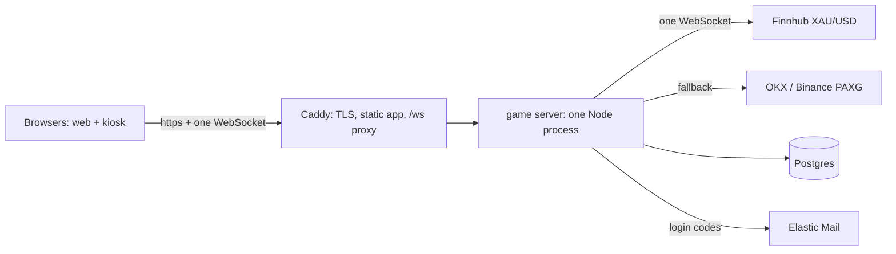

# The box: one server for the whole game

Decision (2026-09-15): the five-vendor layout is replaced by one Linux box. This document is the spec for that build. The Supabase lane on branch `dev` stays as-is for reference; the box lives on this branch.

## Shape



One Node process does everything the relay, the edge functions, and Supabase Auth did:

- holds **one** upstream Finnhub WebSocket (PAXG exchanges as fallback) and fans every tick out to every connected browser;
- runs rounds **in memory**: open on the player's message, settle on its own 5-second timer against the tick stream it is already holding, write the result, push the verdict down the same socket;
- owns the ledger through the same Postgres functions as before;
- issues and verifies login codes (a small `otp_codes` table + Elastic).

Postgres runs in Docker next to it. Caddy terminates TLS, serves the built app, and proxies `/ws`.

Invariants are unchanged: the server decides every outcome; the client never reports its own result; one round in flight per identity; a coupon is claimed once, atomically, after five consecutive server-validated wins.

## What carries over from `dev` (do not rewrite)

- `supabase/migrations/0001..0007` -> `db/migrations/` with one edit: `players.id` no longer references `auth.users`; `ensure_player` takes the email from `players` itself. The revokes/grants targeting `anon`/`authenticated` are dropped (there are no such roles; the app connects with one role and the client never touches Postgres).
- `supabase/seed.sql` -> `db/seed.sql` unchanged.
- `supabase/tests/**` (pgTAP) -> `db/tests/` with the same role edits.
- `relay/server.js` -> `server/` as the starting point; it already does the upstream connection and fan-out.
- `docs/test-contract.md` stays the contract; the HTTP section is replaced by the socket protocol below.
- `test/unit/**` unchanged. `test/integration/**` is rewritten against the socket. `tests/e2e/**` mostly unchanged (the UI is the same).
- `src/api/**` keeps its shape; `game.js` and `kiosk.js` speak the socket instead of HTTP; `session.js` uses the server's own login.

## Socket protocol (JSON frames over `/ws`)

Server -> client (unchanged from the relay, plus rounds):
- `{type:"hello", price, t, source}` on connect; `{type:"price", price, t, source}` on every tick; `{type:"ping"}`.
- `{type:"round_opened", round_id, start_price, start_at}`
- `{type:"round_settled", round_id, outcome, delta, mult, coins, streak, record, best_streak, start_price, end_price, coupon}` (coupon only for kiosks)
- `{type:"me", coins, record, streak, best_streak, wins, rounds, free_refill_used, display_name, email_verified}`
- `{type:"leaderboard", rows:[{display_name, record, rank}]}`
- `{type:"error", code}` with the same codes as the contract (`round_in_flight`, `insufficient_coins`, `rate_limited`, `feed_stale`, `unauthenticated`, `kiosk_unauthorized`, `already_claimed`, `email_required`, `refill_unavailable`, `bad_dir`, `bad_lever`).

Client -> server:
- `{type:"auth", token}` first frame: a player token (see Login) or `{type:"auth", kiosk:"<secret>"}` for a kiosk. Anything else before auth -> `unauthenticated`.
- `{type:"play", dir, lever}` -> `round_opened` immediately, `round_settled` exactly 5 s later.
- `{type:"claim_task", task_id}`, `{type:"free_refill"}`, `{type:"get_me"}`, `{type:"leaderboard"}`.
- `{type:"request_otp", email}` and `{type:"verify_otp", email, code}`.

Settlement runs on the server's timer regardless of the socket: a disconnect after `play` still settles; on reconnect, `get_me` reflects it and any `round_settled` missed is re-sent once (`pending_verdict`).

## Login

- A new visitor gets an anonymous player: the server creates the row and returns a signed player token (HMAC of the id with a server secret); the client stores it in localStorage. Same play-first flow as before.
- `request_otp`: server writes an 8-digit code to `otp_codes(email, code_hash, expires_at, player_id)` and sends it through Elastic's `gold_rush_otp` template (`merge_otp_code`). Rate-limited per email and per IP in the server.
- `verify_otp`: correct code within 10 minutes marks `players.email` verified on the **same** player id (score kept). If that email already belongs to another player, the older row wins and the anonymous row is merged into it (max of record, sum of nothing else).
- Without `ELASTIC_API_KEY` the code is stored in `dev_otps` exactly as today.

## Layout

```
box/
  docker-compose.yml     # postgres:16 + server + caddy
  Caddyfile              # tls, static /srv/app, reverse_proxy /ws -> server:8787
  server/                # the one Node process (ESM, node:test)
    index.js             # http + ws server, auth, routing
    feed.js              # upstream Finnhub/OKX/Binance, tick fan-out, freshness
    rounds.js            # open / 5 s timer / settle via db functions
    ledger.js            # pg client, calls the SQL functions
    otp.js               # codes + Elastic
  db/migrations/ db/seed.sql db/tests/
```

Environment (server): `DATABASE_URL`, `FINNHUB_TOKEN`, `ELASTIC_API_KEY`, `OTP_SENDER`, `PLAYER_TOKEN_SECRET`, `PORT`. All read from the process environment; never from a file a worker can see.

## Deploy

`docker compose up -d` on a $20-40 VPS (4 vCPU / 8 GB), Caddy on 80/443 with the campaign domain, nightly `pg_dump` cron to object storage. Restart policy `unless-stopped`. That is the whole runbook.

## Load

At the doubled projection (100 concurrent, 2,000/day): ~20 settlements/s, 100 sockets, a few ticks/s fanned out. One process handles it with most of the box idle; the 4x case is still fine.
