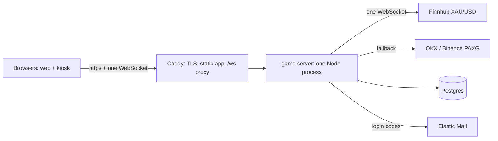

# The box: one server for the whole game

Decision (2026-09-15): the five-vendor layout is replaced by one Linux box. The Supabase lane on branch `dev` stays as reference; the box lives on this branch.

**Layered.** Layer 1 is functionality and smoothness: build it, test it, play it. Layer 2 is security and hardening: specified now as tickets, built only after Layer 1 is playable without errors. Nothing in Layer 2 changes the shape of Layer 1; it tightens it.

## Shape



One Node process holds **one** upstream Finnhub WebSocket (PAXG exchanges as fallback), fans every tick out to every browser, runs rounds in memory on its own 5-second timer against that same tick stream, writes results through the existing Postgres functions, and pushes the verdict down the socket the player is already on.

The invariant is unchanged and belongs to Layer 1, not Layer 2: **the server decides every outcome; the client never reports its own result.** It is what makes the game a game, so it is built first.

---

# Layer 1 - functional and smooth

Done when: nine browsers (5 kiosk, 4 web) play for ten minutes with zero errors, every verdict lands the moment the countdown ends, flats are rare, and a reload mid-round still settles.

## 1.1 Feed (`server/feed.js`)

- One Finnhub WebSocket subscribed to `OANDA:XAU_USD` (measured: ~9 distinct changes per 5 s). Reconnect with backoff.
- Fallback chain when Finnhub is silent for 3 s: OKX PAXG mid, then Binance PAXG mid. Publish the best source that is ticking, exactly as `relay/server.js` does today (that file is the starting point).
- Every tick is broadcast to all connected clients as `{type:"price", price, t, source}`; new clients get `{type:"hello", ...}` with the last tick.
- The server keeps a ring buffer of the last 30 s of ticks. A round's start price is the latest tick at open; its end price is the latest tick at T0+5000 ms. If no tick has arrived in the last 3 s at either moment, the round is void (`feed_stale`).
- Forex market closure (Fri 22:00 UTC to Sun 22:00 UTC): Finnhub goes quiet; PAXG keeps ticking. The fallback covers it; the source label on screen changes.

## 1.2 Socket protocol (`server/index.js`)

JSON frames over one WebSocket at `/ws`.

Server -> client: `hello`, `price`, `ping` (as today), plus `round_opened {round_id, start_price, start_at}`, `round_settled {round_id, outcome, delta, mult, coins, streak, record, best_streak, start_price, end_price, coupon}`, `me {...}`, `leaderboard {rows}`, `error {code}`.

Client -> server: `auth {token}` or `auth {kiosk}` as the first frame; then `play {dir, lever}`, `get_me`, `claim_task {task_id}`, `free_refill`, `leaderboard`, `request_otp {email}`, `verify_otp {email, code}`.

Error codes are the ones in `docs/test-contract.md`.

## 1.3 Rounds (`server/rounds.js`)

- `play` -> call `open_round` (or `open_kiosk_round`) -> reply `round_opened` immediately (target: under 50 ms on the box).
- `setTimeout(5000)` per round, keyed by round id, held in memory. At fire: read end price from the ring buffer, call `settle_round` / `settle_kiosk_round`, push `round_settled` to that player's socket if connected.
- The client runs its own 5-second countdown on the live feed for the show; the verdict arrives as the countdown ends. No held-open request, no polling.
- Disconnect mid-round: the timer still fires and the round settles. On the next `auth`, the server sends `me` and, once, any `round_settled` the client missed (`pending_verdict`).
- Process restart mid-round: on boot the server voids any round still `open` (there is nobody to settle it honestly). Rare, visible, and correct.
- One round in flight per identity is already enforced by the database's partial unique index.

## 1.4 Ledger (`server/ledger.js` + `db/`)

- `supabase/migrations/0001..0007` -> `db/migrations/` with one edit: `players.id` no longer references `auth.users`; `ensure_player` takes the email from `players`. Grants and revokes naming `anon`/`authenticated` are dropped: there are no such roles on the box and the client never touches Postgres.
- `seed.sql` unchanged. `pg` client with a small pool; every mutation is one function call, as today.
- Dev runs against Postgres in Docker; until Docker is repaired on this machine it runs against the existing dev database through `DATABASE_URL`.

## 1.5 Login (minimal)

- First visit: the server creates an anonymous player and returns a **player token** (HMAC-signed id). The client keeps it in localStorage and sends it as `auth`. Same play-first flow as before.
- `request_otp`: 8-digit code into `otp_codes(email, code_hash, expires_at, player_id)`, sent through Elastic's `gold_rush_otp` template; without `ELASTIC_API_KEY` it is stored in `dev_otps` as today. `verify_otp`: correct code within 10 minutes sets `players.email` on the same player id. Score kept.
- Kiosk: `auth {kiosk: "<secret from the launch URL>"}` verified with the existing `verify_kiosk`.

## 1.6 Client (`src/api/`)

Same module shape. `game.js` and `kiosk.js` speak the socket instead of HTTP; `session.js` uses the player token. `useGame.js` keeps its countdown on the live feed and applies the server verdict from `round_settled`. Offline mode (no server) stays as it is.

## 1.7 Layout, run, deploy

```
box/
  docker-compose.yml   # postgres:16, server, caddy
  Caddyfile            # tls <domain>; root /srv/app; reverse_proxy /ws server:8787
  server/  index.js feed.js rounds.js ledger.js otp.js
  db/      migrations/ seed.sql tests/
```

Server env: `DATABASE_URL`, `FINNHUB_TOKEN`, `ELASTIC_API_KEY`, `OTP_SENDER`, `PLAYER_TOKEN_SECRET`, `PORT`. Deploy: `docker compose up -d` on a 4 vCPU / 8 GB VPS; Caddy on 80/443 with the campaign domain.

## 1.8 Layer 1 tests

- Unit: economy oracle (unchanged), feed ring-buffer and freshness, timer scheduling.
- pgTAP: the existing suites with the role edits.
- Socket integration: a node client that authenticates, plays, gets `round_opened` in under 100 ms and `round_settled` at 5.0-5.3 s, disconnects mid-round and finds it settled, two concurrent `play` -> one `round_in_flight`.
- E2E: the existing Playwright promises, unchanged in intent.
- The nine-browser demo as the acceptance run.

---

# Layer 2 - security and hardening (specified now, built after Layer 1)

Each is a ticket. None blocks Layer 1.

| # | Ticket | Why it waits |
|---|---|---|
| S1 | Player token: add expiry and a server-side revocation list; rotate `PLAYER_TOKEN_SECRET` procedure | Cheating the token only matters once real prizes are live |
| S2 | Per-socket rate limits: `play` at most 1 per 3 s, `request_otp` 3 per email per hour and 10 per IP per hour, message flood cut-off | Load protection, not functionality |
| S3 | Kiosk secret out of the URL: exchange the launch-URL secret once for a session cookie so Caddy access logs never hold it; scrub `k=` from logs meanwhile | Log hygiene |
| S4 | Email merge rule: verifying an email already owned by another player merges into the older row (max of record) - specify the exact rule and test it as a cheat vector | Leaderboard integrity at prize time |
| S5 | Postgres least privilege: an `app` role that can only execute the game functions, not read tables directly; `postgres` reserved for migrations | Defense in depth; the client never reaches Postgres either way |
| S6 | Backups: nightly `pg_dump` to object storage, plus one rehearsed restore | Before prizes are paid, not before the first playtest |
| S7 | Ops runbook for a non-engineer: restart, read logs, "the booth says it's frozen" checklist, alert on feed silence and on process restart | Written after the process is stable |
| S8 | Campaign end: freeze the leaderboard at a timestamp, export the top 10 with verified emails | Needed in week four |
| S9 | Coupon exhaustion behaviour and the message the kiosk shows | Product decision, cosmetic |
| S10 | Origin/CORS pinning on the socket, TLS-only cookies, security headers in Caddy | Hardening |
| S11 | Legal: email consent text at the OTP prompt, retention of `otp_codes`/`dev_otps` | Before public launch |

The red-team report from the Supabase lane (`docs/reports/redteam.md`) still applies to the SQL layer and stays the reference for what "held" and what to re-verify on the box.
