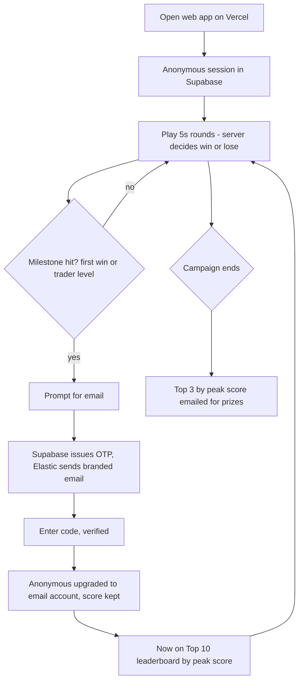
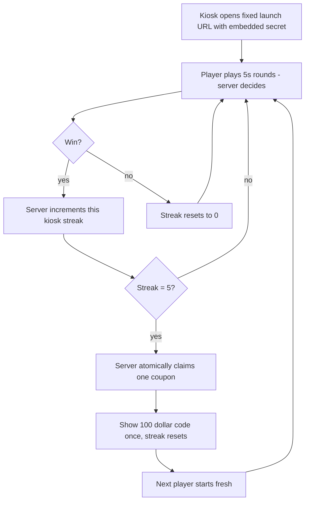
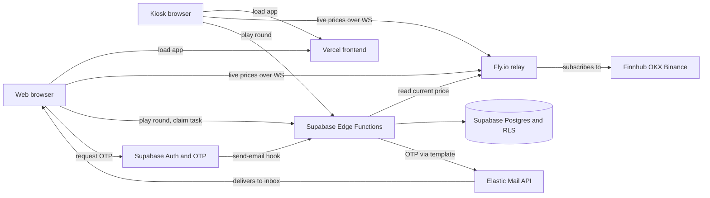
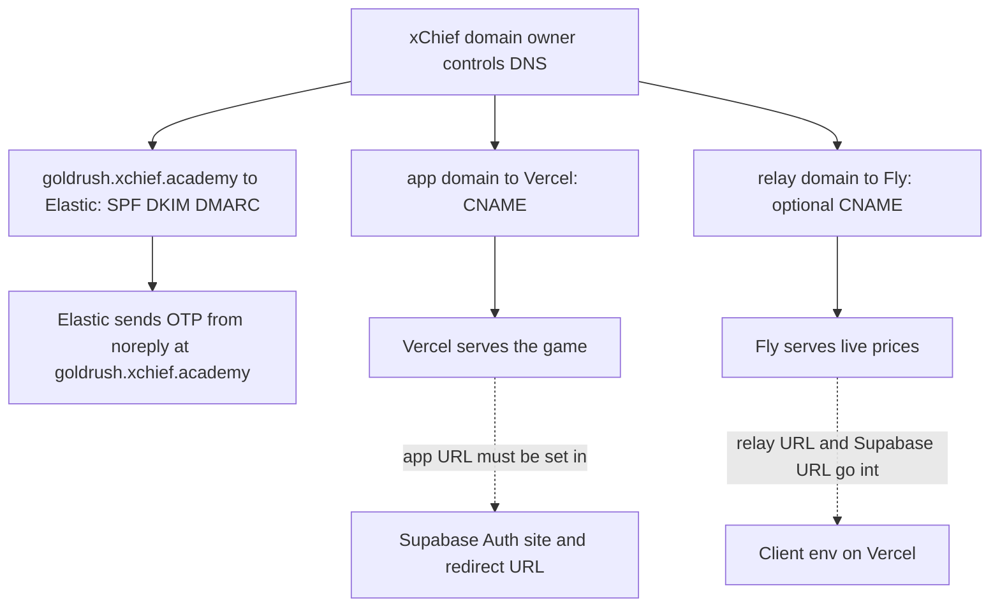
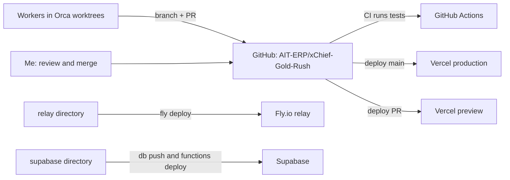

# Journeys and architecture

Reflects the locked decisions: server decides every outcome, Supabase owns the ledger, each round is one held-open Supabase call, relay stays a dumb price feed, leaderboard ranks peak balance.

## 1. Web journey (play first, email later to rank)

## 2. Kiosk journey (ephemeral, no email, coupon on 5 in a row)

## 3. What talks to what

## 4. Who owns which domain and who must know it

## 5. Dev and deploy flow

## Open decision

- Web journey branch: **play-first** (anonymous session, prompt email at a milestone - drawn above, my recommendation) vs **email-gate** (must verify email before the first round). Confirm which.
