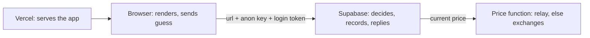

# Who does what

## How Vercel connects to Supabase

It doesn't - not directly. Vercel never talks to Supabase. Vercel serves the browser a static app; **the browser** talks to Supabase. The only "connection" is two public values baked into the build as environment variables in the Vercel project: `VITE_SUPABASE_URL` and `VITE_SUPABASE_ANON_KEY`. The anon key is designed to be public; on its own it grants nothing - Row Level Security decides what each request may do, based on the player's login token.

## Responsibilities

| Party | Owns | Never does |
|---|---|---|
| **Browser (the app)** | Rendering, the visual countdown, collecting the guess and stake, showing the verdict, kiosk launch-URL secret | Decide an outcome, compute coins, hold a secret key |
| **Vercel** | Hosting the static build, CDN, the public domain, the two public env values | Store state, run game logic, hold secrets |
| **Supabase Auth** | Anonymous sessions, email login codes, verifying codes, rate-limiting attempts, issuing the login token | Send email itself (hands the code to Elastic) |
| **Supabase Postgres** | All state: players, coins, rounds, streaks, kiosks, coupons; Row Level Security; the economy and coupon functions | Trust anything the client asserts about results |
| **Supabase Edge Functions** | The 5-second clock, reading the price at both ends, calling the settle functions, the OTP email hook, the price fallback chain | Hold state between requests |
| **Fly relay** | One keyed upstream price connection, live ticks to browsers, `/price` | Game logic, history, credentials beyond the price key |
| **Finnhub** | The broker XAU/USD feed behind one API key | Anything else |
| **Elastic Mail** | Delivering login codes with the branded template | Generate or verify codes |

## The one rule that ties it together

Every number that matters (coins, streak, record, coupon) is computed by Supabase from prices Supabase read itself, on a clock Supabase ran. The browser is a display.
