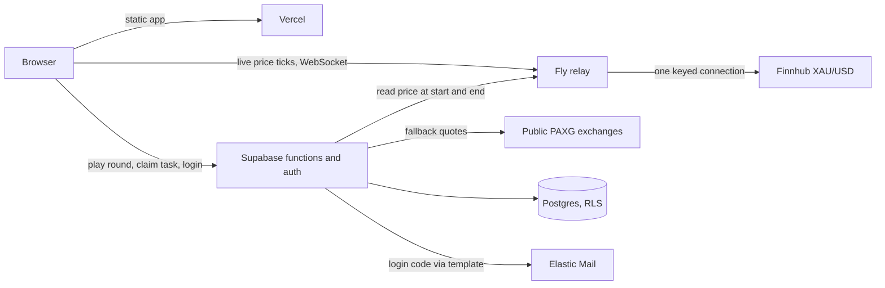

# What each service does - architecture overview

xChief Gold Rush is a 5-second gold-price prediction game with a web mode (email login, month-long leaderboard, prizes for the top 3) and a kiosk mode at the booth (no login, a $100 promo code for five consecutive wins). It is built entirely on managed services; there is no server of our own to patch or scale.

The one design rule everything below serves: **the server decides every outcome. The browser never reports its own result.** A player's browser sends only two things - the direction they guessed and their stake. The price at the start and end of the round, the five-second clock, the win/lose decision, the coin balance, the streak, and the coupon are all determined and recorded server-side. Manipulating the browser (dev tools, replayed requests, edited local storage) cannot change a score or earn a code.

## Supabase - database, authentication, and game logic

Supabase is a managed Postgres database with three things bolted on that we use: authentication, an auto-generated API over the tables, and serverless functions that run next to the database. It is the system of record and the only component that makes decisions.

**Data.** Six tables: players (coins, peak balance, streak), rounds (a full audit trail of every round - both prices, both timestamps, the outcome), tasks and task_claims (the lead-generation rewards, granted once each), kiosks (each booth device's hashed secret), and coupons (the promo codes, each claimed exactly once).

**Access control.** Row Level Security on every table. A signed-in player can read their own row and the public top-10; nothing else is readable, and nothing at all is writable from a browser - write privileges are revoked outright. Every mutation goes through a small set of server functions that run with elevated rights and take the player's identity from their verified login token, never from a request parameter.

**A round.** The browser calls one function. It reads the current gold price, opens the round, waits five seconds on its own clock, reads the price again, decides, applies the economy (stake, combo multiplier, streak), writes the result, and replies. Because the wait happens server-side, a player cannot pick a favourable moment to end the round. One round may be in flight per player at a time, enforced by a database constraint, so nobody can open ten rounds and keep the winners. A round whose price feed went quiet is voided with no effect.

**Kiosk and coupons.** Each booth device carries a secret in its launch URL; the database stores only a bcrypt hash and checks it on every call. Five consecutive server-validated wins claim one coupon in a single atomic statement (row-locked, skip-locked), so two kiosks can never receive the same code.

**Login.** Supabase's built-in email one-time-code flow. Players start anonymously so they can play immediately; entering an email upgrades the same account, keeping their score. Supabase generates and verifies the code and rate-limits attempts; a hook hands the code to Elastic Mail to deliver using the branded template.

**Scale.** Managed Postgres and function runtime; at the projected 50 concurrent players and ~2,000 a day it is well inside a Pro plan. Nothing here is stateful outside the database.

## Vercel - the web application host

Vercel serves the game's front end: a static single-page application (Vite + React). It is a global CDN with a build pipeline - we deploy, it builds the assets and serves them from edge locations near each player. It holds no game state and makes no decisions. Its only configuration is a handful of public environment values (the Supabase project URL, the public anon key, the relay address) baked in at build time. The public campaign domain points here.

## Fly.io - the live gold-price relay

A single small always-on machine running one Node process. It holds one upstream WebSocket to the price providers and rebroadcasts each tick over WebSocket to every open browser. Two reasons it exists as a separate piece: the broker feed permits one connection per API key, so fifty browsers cannot each connect; and it guarantees every screen at the booth shows the identical quote at the same moment.

The relay is deliberately dumb - no history, no game logic, no credentials beyond the price key. It exposes one HTTP endpoint, `/price`, which the Supabase round function reads at the start and end of each round. It is a single instance by design (the one-key constraint), so the game does not depend on it: if the relay is unreachable or stale, the round function falls back to public exchange quotes for PAXG (a gold-backed token, one token per troy ounce) automatically, and play continues.

## Finnhub - the market data source

A market-data vendor. The account provides one API key that unlocks the real-time broker XAU/USD spot feed (OANDA). Only the relay holds this key. Without it, the relay and the round function run on PAXG quotes from public exchanges - accurate to spot gold and available 24/7, but not the broker quote and labelled as such on screen.

## Elastic Mail - transactional email

Delivers the login codes from `no-reply@goldrush.xchief.academy` using the `gold_rush_otp` template. The sending subdomain is verified (SPF, DKIM, DMARC), tested end to end, and the code is injected as a merge field; the browser never sees an email API.

## How they connect

Failure modes, in order of blast radius: Supabase down - no scoring rounds (display still works). Relay down - automatic fallback to exchange quotes, no player impact. Elastic down - existing players keep playing; new email sign-ups wait. Vercel down - the site is unreachable, but nothing is lost.
