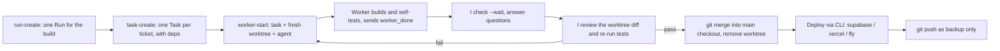

# Ways of working

How this backend gets built: I decompose and decide, builders implement in isolated Orca worktrees, I review, test, and merge locally. **No GitHub in the loop** - Orca is the task board and the remote is only a backup.

## Roles

- **Orchestrator (me).** Owns architecture and decisions, writes the security core (schema, RLS, settle functions), creates the tasks, starts and supervises workers, reviews every diff, runs the tests, merges, deploys.
- **Builders**, each in its own Orca worktree:
  - **Sonnet builder** (`.claude/agents/builder.md`, this account) - the default for ticketed work; **Opus** (`heavy-builder.md`) only for adversarial review, integration, or failures others could not diagnose. The CB account is retired (credits exhausted).
  - **OpenCode Go** (`--agent opencode`, flash models) - cheap parallel tests and boilerplate. Budget-capped ($10 credit), used sparingly.
  - Sonnet/Opus builders run as subagents of this session (the reliable model-binding method); Orca tasks track them by id in the worker_done report.

## The loop (Orca orchestration)



Commands, in order:

```
orca orchestration run-create --objective "<build>" --json
orca orchestration task-create --spec "<ticket>" [--deps '["<task_id>"]'] --json
orca orchestration worker-start --task <task_id> --worktree new-top-level --agent opencode --setup skip --json   # model from opencode.json
orca orchestration check --wait --types worker_done,escalation,question --timeout-ms 900000 --json
orca orchestration task-list --brief --json        # the board
```

## Rules

- Every ticket runs in its own worktree branched off the local main checkout. Nothing is edited on main directly except by me at merge time.
- Every ticket ships with tests. Lint + tests must pass before merge.
- **Tests are written blind.** The test author is never the implementer, and receives only `docs/test-contract.md` (what the system promises), never the implementation. A tester who has to peek at the code to write a test has found a gap in the contract - fix the contract instead. Every new suite gets a red-team pass (`test-red-team` skill): would it fail if the system were wrong?
- I verify builder claims independently (re-run tests, read the diff). A `worker_done` is a claim, not a result.
- Machine-local files (`.env`, `settings.local.json`, `supabase/.temp`) never get committed.
- Budget: OpenCode Go for cheap parallel work (model per task via `opencode.json`); Sonnet builder for solid work; Opus only when it needs real beef.
- The client UI is the marketing lead's and is in flux. Backend touches the client through **one thin module** (`src/api/`) so visual changes never collide with the backend.

## Deploys (all CLI, no GitHub integration)

- Supabase: `npx supabase db push` (schema), `npx supabase functions deploy`, `npx supabase secrets set --env-file .env`.
- Vercel: `npx vercel deploy --prod` from the repo.
- Fly: `flyctl deploy` from `relay/`.

## Local validation

Docker + `npx supabase start` runs a local Postgres/Auth/Edge stack. `npx supabase db reset` applies migrations + seed; `npx supabase test db` runs the pgTAP suite; `npx supabase functions serve --env-file .env` serves the edge functions.
